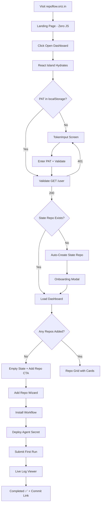

# repoflow — Implementation Plan v3.0 (Final)

> Zero-backend static web control plane for GitHub repository orchestration with free AI coding agents.
> **Domain**: `repoflow.oriz.in` · **Repo**: `chirag127/repoflow` · **Package Manager**: `pnpm`

---

## Design Direction & Visual References

````carousel

<!-- slide -->

````

---

## User Review Required

> [!IMPORTANT]
> **Domain**: `repoflow.oriz.in` confirmed. Will deploy to Cloudflare Pages with custom domain.

> [!IMPORTANT]
> **9 AI CLI Agents**: Gemini CLI, Aider, OpenCode, Crush, Qwen Code, Goose, Claude Code (via OpenRouter `:free`), Codex CLI (via OpenRouter `:free`), Aider+Ollama (local).

> [!IMPORTANT]
> **10 Free LLM Providers**: Google AI Studio, Groq, OpenRouter, Mistral, Cerebras, HuggingFace, GitHub Models, Cloudflare Workers AI, Together AI, DashScope. All latest models (Gemini 3.1 Pro, Llama 4, etc.)

> [!IMPORTANT]
> **All MCP Servers Enabled**: Every MCP server from your config is included + official servers. Multiple servers for the same task provide fallback redundancy.

> [!WARNING]
> **API Keys**: ALL keys from your MCP config will be in `.env.example` as placeholders. Actual values go in `.env` (gitignored) and deployed as GitHub Secrets via Settings page. **No keys in source.**

> [!IMPORTANT]
> **pnpm**: Confirmed as best package manager for this project — faster than npm, more disk-efficient, strict dependency handling.

---

## 🎨 Design System — "Void Terminal" Aesthetic

**Tone**: Dark luxury meets terminal brutalism. A hacker's command center wrapped in glassmorphism and subtle orbital animations. NOT generic dark mode — this is a **deep void with neon data streams**.

**Typography** (distinctive, NOT generic):
- **Display/Headlines**: `Satoshi` (bold, geometric, premium feel) via Fontshare CDN
- **Body/UI**: `General Sans` (clean, modern, professional)
- **Mono/Code/Logs**: `Geist Mono` (Vercel's monospace — sharper than JetBrains Mono, more unique)
- **Fallback**: system-ui stack

**Color Palette** — Deep void with electric accents:

```css
@theme {
  /* === VOID SURFACES (avoid pure black) === */
  --color-void:          oklch(0.11 0.02 260);   /* #0a0e17 deep navy-black */
  --color-surface:       oklch(0.14 0.02 260);   /* #111827 card backgrounds */
  --color-surface-elevated: oklch(0.17 0.015 260); /* #1a2035 modals/popovers */
  --color-surface-hover: oklch(0.20 0.015 260);   /* #222d45 hover states */

  /* === BORDERS & DIVIDERS === */
  --color-border:        oklch(0.25 0.02 260);   /* #2a3352 subtle borders */
  --color-border-bright: oklch(0.35 0.03 250);   /* #3d4f7a focus rings */

  /* === TEXT HIERARCHY === */
  --color-text:          oklch(0.90 0.01 250);   /* #e2e8f0 primary */
  --color-text-secondary: oklch(0.65 0.02 250);  /* #8b9cc0 labels */
  --color-text-muted:    oklch(0.45 0.02 250);   /* #5a6888 timestamps */

  /* === ELECTRIC ACCENTS === */
  --color-accent:        oklch(0.70 0.18 250);   /* #58a6ff blue primary */
  --color-success:       oklch(0.65 0.20 150);   /* #3fb950 green */
  --color-error:         oklch(0.65 0.22 25);    /* #ff7b72 red */
  --color-warning:       oklch(0.70 0.18 55);    /* #f0883e orange */
  --color-info:          oklch(0.65 0.15 280);   /* #d2a8ff purple */
  --color-cyan:          oklch(0.70 0.15 195);   /* #39c5cf cyan */

  /* === AGENT BRAND COLORS (for badges) === */
  --color-agent-gemini:      oklch(0.55 0.20 260); /* #1B73E8 */
  --color-agent-aider:       oklch(0.75 0.16 80);  /* #F4B942 */
  --color-agent-opencode:    oklch(0.50 0.25 290); /* #7C3AED */
  --color-agent-crush:       oklch(0.60 0.22 340); /* #EC4899 */
  --color-agent-qwen:        oklch(0.65 0.20 40);  /* #FF6B35 */
  --color-agent-goose:       oklch(0.55 0.18 160); /* #059669 */
  --color-agent-claude:      oklch(0.65 0.18 60);  /* #D97706 */
  --color-agent-codex:       oklch(0.60 0.18 165); /* #10B981 */
  --color-agent-ollama:      oklch(0.50 0.03 250); /* #6B7280 */
}
```

**Visual Effects**:
- **Background**: Animated gradient mesh (CSS `@keyframes`) with subtle noise texture overlay (`background-image: url("data:image/svg+xml,...")`)
- **Cards**: Glassmorphism — `backdrop-filter: blur(12px); background: rgba(17,24,39,0.7); border: 1px solid rgba(42,51,82,0.5)`
- **Glows**: Accent color box-shadows on focus/hover — `box-shadow: 0 0 20px oklch(0.70 0.18 250 / 0.15)`
- **Terminal log viewer**: Scanline overlay effect, cursor blink animation, ANSI 256-color support
- **Micro-animations**: Staggered card reveals (`animation-delay`), status badge pulse, sidebar hover slides
- **Orbital motif**: SVG satellite/orbit animation on landing page hero and empty states

**Critical Anti-Patterns** (per design skill — NEVER do these):
- ❌ No Inter, Roboto, Arial, or system-default fonts
- ❌ No purple-gradient-on-white cliché
- ❌ No cookie-cutter card layouts
- ❌ No generic shadcn/ui defaults without customization

---

## 📡 All Free LLM API Providers & Latest Models (April 2026)

| # | Provider | Env Variable | Latest Free Models | Free Tier | Signup |
|---|----------|-------------|-------------------|-----------|--------|
| 1 | **Google AI Studio** | `GEMINI_API_KEY` | Gemini 3.1 Pro Preview, Gemini 2.5 Pro, Gemini 2.5 Flash, Gemini 2.5 Flash-Lite | 1000+ req/day, free tier | [aistudio.google.com](https://aistudio.google.com) |
| 2 | **Groq** | `GROQ_API_KEY` | Llama 4 Scout, Llama 4 Maverick, Llama 3.3 70B, Gemma 2, Qwen 3 | Ultra-fast inference, generous free | [console.groq.com](https://console.groq.com) |
| 3 | **OpenRouter** | `OPENROUTER_API_KEY` | Any model + `:free` suffix (e.g. `meta-llama/llama-4-scout:free`, `google/gemini-2.5-pro:free`, `deepseek/deepseek-r1:free`) | Unlimited free models via `:free` | [openrouter.ai](https://openrouter.ai) |
| 4 | **Mistral AI** | `MISTRAL_API_KEY` | Mistral Large, Codestral, Mistral Small, Pixtral | Free Experiment tier, no CC | [console.mistral.ai](https://console.mistral.ai) |
| 5 | **Cerebras** | `CEREBRAS_API_KEY` | Llama 3.3 70B, Qwen 3 235B (blazing fast) | ~1M tokens/day free, no CC | [cloud.cerebras.ai](https://cloud.cerebras.ai) |
| 6 | **Hugging Face** | `HF_TOKEN` | Thousands of open models (Llama, Qwen, Mistral) | Free Inference API | [huggingface.co](https://huggingface.co/settings/tokens) |
| 7 | **GitHub Models** | `GITHUB_TOKEN` (PAT) | GPT-4o, Llama 3.3, DeepSeek-R1 | Free for dev/prototyping | [github.com/marketplace/models](https://github.com/marketplace/models) |
| 8 | **Cloudflare Workers AI** | `CF_API_TOKEN` | Llama 3.1/3.2, Mistral 7B, various open models | 10,000 neurons/day free | [developers.cloudflare.com/workers-ai](https://developers.cloudflare.com/workers-ai) |
| 9 | **Together AI** | `TOGETHER_API_KEY` | Llama, Qwen, Mixtral (free credits on signup) | Free credits on signup | [api.together.xyz](https://api.together.xyz) |
| 10 | **DashScope** | `QWEN_API_KEY` | Qwen 3 (latest), Qwen 2.5-Coder-32B | Free tier available | [dashscope.aliyuncs.com](https://dashscope.aliyuncs.com) |

---

## 🤖 All 9 AI Coding CLI Agents

### Agent 1: Gemini CLI (Google) — ⭐ Recommended Default

| Property | Value |
|----------|-------|
| Package | `@google/gemini-cli` |
| Install | `npm install -g @google/gemini-cli@latest` |
| Headless | `gemini -p "PROMPT" --output-format stream-json --non-interactive` |
| Env | `GEMINI_API_KEY` |
| Free Tier | Gemini 3.1 Pro — 1000+ req/day FREE |
| MCP Support | ✅ `.gemini/settings.json` |
| MCP Tools Used | sequential-thinking, context7, ref, linkup, docfork, exa, filesystem, github, memory, fetch |

### Agent 2: Aider (AI Pair Programmer)

| Property | Value |
|----------|-------|
| Install | `pip install aider-chat --break-system-packages` |
| Headless | `aider --model gemini/gemini-2.5-pro --message "PROMPT" --yes --no-git` |
| Alt Models | `groq/llama-3.3-70b-versatile`, `openrouter/google/gemini-2.5-pro:free`, `mistral/codestral-latest`, `cerebras/llama-3.3-70b` |
| Env | `GEMINI_API_KEY` or `GROQ_API_KEY` or `OPENROUTER_API_KEY` or `MISTRAL_API_KEY` or `CEREBRAS_API_KEY` |
| MCP Support | ❌ (native repomap handles multi-file context) |

### Agent 3: OpenCode (Multi-Provider Terminal Agent)

| Property | Value |
|----------|-------|
| Install | `curl -fsSL https://opencode.ai/install \| bash` |
| Headless | `opencode -p "PROMPT" -f json -q` |
| Env | `GEMINI_API_KEY` or `GROQ_API_KEY` or `OPENROUTER_API_KEY` or `CEREBRAS_API_KEY` |
| MCP Support | ✅ `.opencode/config.json` |
| MCP Tools Used | sequential-thinking, context7, ref, filesystem, github, memory, fetch |

### Agent 4: Crush (Charmbracelet)

| Property | Value |
|----------|-------|
| Install | Binary from GitHub releases |
| Headless | `crush --prompt "PROMPT" --yes 2>&1` |
| Env | `OPENROUTER_API_KEY` or `GEMINI_API_KEY` or `GROQ_API_KEY` |
| MCP Support | ✅ config.toml |
| MCP Tools Used | sequential-thinking, filesystem, github |

### Agent 5: Qwen Code (Alibaba)

| Property | Value |
|----------|-------|
| Package | `@qwen-code/qwen-code` |
| Install | `npm install -g @qwen-code/qwen-code@latest` |
| Headless | `qwen -p "PROMPT" --yolo` |
| Env | `QWEN_API_KEY` or `OPENROUTER_API_KEY` |
| MCP Support | ✅ `.qwen/settings.json` |
| MCP Tools Used | sequential-thinking, context7, ref, filesystem, github, memory, fetch |

### Agent 6: Goose (Block/Square)

| Property | Value |
|----------|-------|
| Install | `curl -fsSL https://github.com/block/goose/releases/latest/download/install.sh \| bash` |
| Headless | `goose run --text "PROMPT" 2>&1` |
| Env | `GEMINI_API_KEY` or `GROQ_API_KEY` or `OPENROUTER_API_KEY` |
| MCP Support | ✅ config.yaml (strongest MCP ecosystem) |
| MCP Tools Used | sequential-thinking, context7, ref, linkup, exa, filesystem, github, memory, fetch |

### Agent 7: Claude Code (Anthropic) — Free via OpenRouter

| Property | Value |
|----------|-------|
| Package | `@anthropic-ai/claude-code` |
| Install | `npm install -g @anthropic-ai/claude-code` |
| Headless | `claude -p "PROMPT" --output-format json --allowedTools "Read,Write,Edit,Bash"` |
| Env | `ANTHROPIC_BASE_URL=https://openrouter.ai/api`, `ANTHROPIC_API_KEY=$OPENROUTER_API_KEY`, `ANTHROPIC_MODEL=meta-llama/llama-4-scout:free` |
| MCP Support | ✅ `.claude/settings.json` |
| MCP Tools Used | sequential-thinking, context7, ref, linkup, docfork, exa, filesystem, github, memory, fetch |
| Notes | Uses OpenRouter `:free` models. User provides `OPENROUTER_API_KEY`. |

### Agent 8: Codex CLI (OpenAI) — Free via OpenRouter

| Property | Value |
|----------|-------|
| Package | `@openai/codex` |
| Install | `npm install -g @openai/codex` |
| Headless | `codex exec --full-auto "PROMPT"` |
| Env | `model_provider=openrouter` in config, `OPENROUTER_API_KEY` |
| MCP Support | ❌ |
| Notes | Routes through OpenRouter for free `:free` models. |

### Agent 9: Aider + Ollama (100% Free Local)

| Property | Value |
|----------|-------|
| Install | `pip install aider-chat --break-system-packages && curl -fsSL https://ollama.com/install.sh \| sh && ollama pull codellama:13b` |
| Headless | `OLLAMA_API_BASE=http://localhost:11434 aider --model ollama/codellama:13b --message "PROMPT" --yes` |
| Env | None (fully local, zero cost) |
| MCP Support | ❌ |
| Notes | Runs on GH Actions runner (~14GB RAM). Suitable for 7B-13B models. |

---

## 🔌 All MCP Servers — Enabled with Fallback Redundancy

Every MCP server from the user's config is enabled. Multiple servers cover the same capabilities for failover.

### Documentation & Knowledge Lookup (3 servers — fallback chain)

| Priority | Server | Type | Config | Env |
|----------|--------|------|--------|-----|
| 1st | **context7** | HTTP serverUrl | `https://mcp.context7.com/mcp` | `CONTEXT7_API_KEY` |
| 2nd | **ref** | HTTP serverUrl | `https://api.ref.tools/mcp` | `REF_API_KEY` (header: `x-ref-api-key`) |
| 3rd | **docfork** | npx stdio | `npx -y docfork` | None |

### Web Search & Research (3 servers — fallback chain)

| Priority | Server | Type | Config | Env |
|----------|--------|------|--------|-----|
| 1st | **exa** | HTTP serverUrl | `https://mcp.exa.ai/mcp` | `EXA_API_KEY` |
| 2nd | **linkup** | HTTP serverUrl | `https://mcp.linkup.so/mcp?apiKey=...` | `LINKUP_API_KEY` |
| 3rd | **kindly-web-search** | uvx stdio | `uvx kindly-web-search-mcp-server` | `SERPER_API_KEY`, `TAVILY_API_KEY` |

### Reasoning

| Server | Type | Config | Env |
|--------|------|--------|-----|
| **sequential-thinking** | npx stdio | `npx -y @modelcontextprotocol/server-sequential-thinking` | None |

### Filesystem & Code Operations

| Server | Type | Config | Env |
|--------|------|--------|-----|
| **filesystem** | npx stdio | `npx -y @modelcontextprotocol/server-filesystem /workspace` | None |
| **github** | npx stdio | `npx -y @modelcontextprotocol/server-github` | `GITHUB_TOKEN` |

### Utility

| Server | Type | Config | Env |
|--------|------|--------|-----|
| **memory** | npx stdio | `npx -y @modelcontextprotocol/server-memory` | None |
| **fetch** | npx stdio | `npx -y @modelcontextprotocol/server-fetch` | None |

### MCP Config Per Agent (written at runtime in GitHub Actions)

Each agent gets ALL applicable MCP servers in its config file. The workflow writes the correct format per agent:

| Agent | Config File | Servers Included |
|-------|------------|-----------------|
| Gemini CLI | `.gemini/settings.json` | ALL 10 servers |
| OpenCode | `.opencode/config.json` | ALL 10 servers |
| Qwen Code | `.qwen/settings.json` | ALL 10 servers |
| Crush | `/tmp/crush-config.toml` | sequential-thinking, filesystem, github, memory |
| Goose | `/tmp/goose-config.yaml` | ALL 10 servers |
| Claude Code | `.claude/settings.json` | ALL 10 servers |
| Aider | N/A | No MCP support |
| Codex CLI | N/A | No MCP support |
| Aider+Ollama | N/A | No MCP support |

---

## 📦 Complete `.env.example` (All API Keys)

```env
# ============================================
# repoflow — Environment Variables Reference
# ============================================
# Copy to .env and fill in your values.
# Deploy these as GitHub Secrets via Settings.
# NEVER commit .env to source control.

# === AI MODEL PROVIDER KEYS ===
GEMINI_API_KEY=                    # Google AI Studio — aistudio.google.com
GROQ_API_KEY=                      # Groq Console — console.groq.com
OPENROUTER_API_KEY=                # OpenRouter — openrouter.ai
MISTRAL_API_KEY=                   # Mistral AI — console.mistral.ai
CEREBRAS_API_KEY=                  # Cerebras — cloud.cerebras.ai
TOGETHER_API_KEY=                  # Together AI — api.together.xyz
HF_TOKEN=                         # Hugging Face — huggingface.co/settings/tokens
QWEN_API_KEY=                      # DashScope/Alibaba — dashscope.aliyuncs.com
CF_API_TOKEN=                      # Cloudflare Workers AI — dash.cloudflare.com

# === MCP SERVER KEYS ===
CONTEXT7_API_KEY=                  # Context7 — context7.com
REF_API_KEY=                       # Ref Tools — ref.tools
LINKUP_API_KEY=                    # Linkup — linkup.so
EXA_API_KEY=                       # Exa — exa.ai
SERPER_API_KEY=                    # Serper — serper.dev
TAVILY_API_KEY=                    # Tavily — tavily.com

# === GITHUB (auto-available in Actions) ===
# GITHUB_TOKEN is automatically available in GitHub Actions
# For local dev, use your GitHub PAT
GITHUB_TOKEN=
```

---

## Proposed Changes

### Phase 1: Project Scaffold & Foundation

Initialize Astro 6 + React 19 + Tailwind CSS v4 + shadcn/ui + pnpm.

```bash
pnpm create astro@latest ./ -- --template minimal --install --git
pnpm astro add react
pnpm astro add tailwind   # uses @tailwindcss/vite for v4
npx shadcn@latest init -t astro
```

#### [NEW] `astro.config.mjs`
- `output: 'static'`, `site: 'https://repoflow.oriz.in'`
- Integrations: `@astrojs/react`
- Vite: `@tailwindcss/vite` plugin, optimizeDeps for tweetnacl

#### [NEW] `tsconfig.json` — strict:true, paths `@/*` → `src/*`
#### [NEW] `vitest.config.ts` — jsdom, globals, coverage v8 ≥80%
#### [NEW] `components.json` — shadcn/ui Astro config
#### [NEW] `package.json` — all deps via pnpm Managed by the scaffold commands

#### [MODIFY] `.gitignore`
```
dist/
.astro/
node_modules/
.env
.env.local
.wrangler/
*.tsbuildinfo
coverage/
```

#### [NEW] `.env.example` — (see above)

#### [NEW] `src/styles/globals.css`
Premium design system with Tailwind v4 `@import "tailwindcss"` + `@theme`:
- Satoshi + General Sans + Geist Mono font imports
- Complete OKLCH color palette tokens
- Glassmorphism utility classes
- Animated gradient mesh background
- Noise texture overlay
- Terminal/ANSI color classes for log viewer
- Scanline effect for terminal
- Custom scrollbar styling
- Stagger animation utilities
- Glow/focus ring utilities

---

### Phase 2: Type System (7 files in `src/types/`)

#### [NEW] `src/types/repository.ts`
```typescript
type AgentType =
  | 'gemini' | 'aider' | 'opencode'
  | 'crush' | 'qwen' | 'goose'
  | 'claude-code' | 'codex' | 'aider-ollama';
```
- `ManagedRepository` — id, owner, name, fullName, defaultBranch, description, isPrivate, language, stars, addedAt, lastRunId, lastRunStatus, defaultAgentType, workflowInstalled, workflowSha, deployedSecrets[]

#### [NEW] `src/types/run.ts`
- `RunStatus` = `'queued' | 'dispatched' | 'in_progress' | 'completed' | 'failed' | 'cancelled'`
- `AgentRun` — id, repositoryId, repositoryFullName, prompt, status, agentType, branch, workflowRunId, jobId, createdAt, dispatchedAt, startedAt, completedAt, durationMs, commitSha, commitUrl, logUrl, error, templateId

#### [NEW] `src/types/agent.ts` — AgentExecutor, AgentConfig interfaces
#### [NEW] `src/types/prompt-template.ts` — PromptTemplate interface
#### [NEW] `src/types/config.ts` — GlobalConfig interface
#### [NEW] `src/types/github.ts` — All GitHub API response types
#### [NEW] `src/types/mcp.ts` — McpServerDefinition, McpSettings

---

### Phase 3: Core Library Layer (18 files in `src/lib/`)

#### [NEW] `src/lib/github-client.ts`
- Authenticated fetch: Authorization header, `X-GitHub-Api-Version`, rate limit tracking via `X-RateLimit-Remaining` headers
- 401 → auth-error event, 403 rate limit → backoff, 5xx → retry max 2

#### [NEW] `src/lib/github-api/` (7 files)
- `index.ts` — re-exports
- `user.ts` — GET /user, GET /users/{username}
- `repos.ts` — search repos, get repo, list user repos, create repo
- `contents.ts` — read file, write file (with SHA), delete file, list dir
- `workflows.ts` — list workflows, dispatch, list runs, get run, cancel
- `jobs.ts` — get jobs for run, get job logs (follow 302 redirect)
- `secrets.ts` — get public key, create/update encrypted secret

#### [NEW] `src/lib/state-manager.ts`
- `readFile<T>`, `writeFile<T>`, `deleteFile`, `listDirectory`, `initStateRepo`
- State repo name: `{username}-repoflow-state` (auto-created)

#### [NEW] `src/lib/concurrency.ts`
- `withOptimisticLock<T>()` — 409 retry with SHA re-fetch, max 3 retries

#### [NEW] `src/lib/workflow-installer.ts`
- Check/install `repoflow-agent.yml` in target repos via Contents API

#### [NEW] `src/lib/secret-encryptor.ts`
- `tweetnacl` + `tweetnacl-sealedbox-js` sealed box encryption
- Compatible with GitHub's libsodium format

#### [NEW] `src/lib/env-parser.ts`
- Parse `.env` text → `Record<string, string>` with comment/export handling

#### [NEW] `src/lib/log-parser.ts`
- `parseAnsiToHtml()`: ANSI 16/256/truecolor escape → styled spans
- `parseGeminiStreamJson()`: NDJSON → LogLine[]
- `formatDuration()`, `extractLogLines()`

#### [NEW] `src/lib/nanoid.ts`
- Tiny ID generator using `crypto.getRandomValues`

---

### Phase 4: Agent Registry & MCP Config (13 files)

#### [NEW] `src/lib/agents/types.ts` — AgentExecutor interface
#### [NEW] `src/lib/agents/registry.ts` — `AGENT_REGISTRY` map of all 9 agents

Each agent file defines: displayName, description, requiredSecrets, optionalSecrets, freeModelProviders, installStep, executeCommand, mcpConfigFile, supportsMcp, headlessFlag, notes.

#### [NEW] `src/lib/agents/gemini.ts`
#### [NEW] `src/lib/agents/aider.ts`
#### [NEW] `src/lib/agents/opencode.ts`
#### [NEW] `src/lib/agents/crush.ts`
#### [NEW] `src/lib/agents/qwen.ts`
#### [NEW] `src/lib/agents/goose.ts`
#### [NEW] `src/lib/agents/claude-code.ts` — OpenRouter `:free` config
#### [NEW] `src/lib/agents/codex.ts` — OpenRouter `:free` config
#### [NEW] `src/lib/agents/aider-ollama.ts`

#### [NEW] `src/lib/mcp/servers.ts` — All 10 MCP server definitions with redundancy groups
#### [NEW] `src/lib/mcp/config-generator.ts`
Generates per-agent config with ALL applicable servers including fallback groups:
- Doc lookup: context7 → ref → docfork
- Web search: exa → linkup → kindly-web-search
- Reasoning: sequential-thinking
- Code ops: filesystem, github, memory, fetch

---

### Phase 5: React Hooks (7 files in `src/hooks/`)

#### [NEW] `useGitHubAuth.ts` — PAT localStorage CRUD + GET /user validation
#### [NEW] `useHashRouter.ts` — Hash-based SPA router with params
#### [NEW] `useLogPoller.ts` — 3-phase polling (queued→in_progress→streaming)
#### [NEW] `useRateLimit.ts` — Track X-RateLimit-Remaining across all fetches
#### [NEW] `useStateRepo.ts` — Wraps state-manager for React
#### [NEW] `useOnline.ts` — `navigator.onLine` + event tracking
#### [NEW] `useSecretDeployer.ts` — Encrypt + deploy to GitHub Secrets API

---

### Phase 6: shadcn/ui Components (~25 files in `src/components/ui/`)

Installed via `npx shadcn@latest add` and customized with Void Terminal design system:
- button, card, input, textarea, badge, dialog, alert-dialog
- toast, toaster (sonner), tooltip, skeleton, separator
- scroll-area, alert, progress, tabs, dropdown-menu
- avatar, select, switch, slider, label, popover, command

---

### Phase 7: Static Pages — Zero JS (8+ files)

#### [NEW] `src/layouts/BaseLayout.astro`
- HTML shell with dark mode class, SEO meta, OG tags
- Satoshi + General Sans + Geist Mono font preloads
- Animated gradient mesh background CSS
- JSON-LD WebApplication schema

#### [NEW] `src/layouts/LegalLayout.astro` — Legal pages wrapper

#### [NEW] `src/pages/index.astro` — Landing Page (ZERO JavaScript)

**Design**: Deep void background with animated gradient mesh. Orbital SVG hero illustration. Staggered text reveals via CSS animation. Agent showcase as horizontally scrolling cards with brand colors.

Sections:
1. **Navbar** — Sticky, backdrop-blur, logo + "Open Dashboard" CTA
2. **Hero** — "AI Agents for Every GitHub Repo — Free" with orbital SVG
3. **How It Works** — 3-step visual with icons (key → git-branch → terminal)
4. **Features Grid** — 6 glassmorphism cards with glow accents
5. **Agent Showcase** — 9 agent cards with brand colors, horizontally scrollable
6. **Free Providers** — Logo grid of all 10 providers
7. **FAQ** — Pure CSS accordion (no JS), 6+ questions
8. **Footer** — Links, legal, GitHub

SEO:
- `<title>repoflow — Free AI Coding Agents for GitHub Repositories</title>`
- OG tags, Twitter cards, canonical URL, JSON-LD

#### [NEW] `src/pages/dashboard.astro` — Dashboard shell + `<DashboardApp client:only="react" />`
#### [NEW] `src/pages/privacy.astro` — Privacy policy (static)
#### [NEW] `src/pages/terms.astro` — Terms of service (static)
#### [NEW] `src/pages/404.astro` — "Lost in Orbit" 404 page

#### Landing Components (8 files in `src/components/landing/`):
- Navbar.astro, Hero.astro, HowItWorks.astro, FeaturesGrid.astro
- AgentShowcase.astro, TechStack.astro, FAQ.astro, Footer.astro

---

### Phase 8: Dashboard React Components (~35 files)

#### Auth (3 files)
- `TokenInput.tsx` — Full-page PAT entry with validation, show/hide, scope checker
- `AuthGuard.tsx` — Renders TokenInput if no PAT, else children
- `UserBadge.tsx` — Avatar + username, dropdown with sign-out

#### Dashboard Shell (7 files)
- `DashboardApp.tsx` — Root: AuthGuard → DashboardLayout → hash router
- `DashboardLayout.tsx` — Sidebar + Topbar + content
- `Sidebar.tsx` — Nav: Repos, Runs, Templates, Settings (mobile: bottom tab bar)
- `Topbar.tsx` — Logo, rate limit badge, user badge
- `RateLimitBadge.tsx` — Live counter with progress bar
- `OfflineBanner.tsx` — Offline warning strip
- `EmptyState.tsx` — Reusable with orbital SVG illustration

Hash Routes:
```
#/repos                  → RepoList
#/repos/add              → AddRepo (4-step wizard)
#/repos/create           → CreateRepo
#/repos/:repoId          → RepoDetail
#/repos/:repoId/new-run  → NewRun
#/runs                   → RunHistory
#/runs/:runId            → RunDetail (+ live LogViewer)
#/templates              → PromptTemplates
#/settings               → Settings (7 tabs)
```

#### Repository Views (7 files in `repos/`)
- `RepoList.tsx` — Grid with skeleton loading, empty state
- `RepoCard.tsx` — Glassmorphism card with status, agent badge, actions dropdown
- `AddRepo.tsx` — 4-step wizard: Search → Install Workflow → Deploy Secret → Done
- `CreateRepo.tsx` — Create new GitHub repo + auto-add
- `RepoDetail.tsx` — Quick run textarea, workflow status, secrets status, recent runs
- `WorkflowInstaller.tsx` — One-click install with progress
- `SecretDeployer.tsx` — Encrypt + deploy per repo

#### Run Views (5 files in `runs/`)
- `RunHistory.tsx` — Filterable table: status, agent, repo, sort
- `RunRow.tsx` — Table row with status badge, truncated prompt
- `RunDetail.tsx` — Full run info + LogViewer
- `NewRun.tsx` — Prompt textarea + agent selector + branch + template quick-pick
- `RunStatusBadge.tsx` — Animated color-coded badge (pulse on in_progress)

#### Log Viewer (3 files in `logs/`)
- `LogViewer.tsx` — Terminal-style: #0a0e17 bg, Geist Mono, line numbers, ANSI colors, auto-scroll, scanline overlay, cursor blink
- `LogLine.tsx` — Single line with number + ANSI-parsed HTML
- `LogControls.tsx` — Copy, download, scroll-to-bottom, font size

#### Templates (4 files in `templates/`)
- `PromptTemplates.tsx` — Grid + 8 built-in templates + user templates
- `TemplateCard.tsx` — Preview with variable chips, usage count
- `TemplateEditor.tsx` — Modal: name, description, template text, live `{{variable}}` detection
- `TemplateVariables.tsx` — Fill-in-the-blank form

#### Settings (8 files in `settings/`)

**Tab 1: Authentication** — Current account card, change token, sign out
**Tab 2: State Repository** — Current repo info, storage stats, change/create
**Tab 3: AI Agents** — Default agent selector, 9 agent info cards with free tier details, model selector per agent
**Tab 4: API Keys & Secrets** — Individual secret entry (all 15 keys), .env file paste textarea, per-repo deployment status grid
**Tab 5: MCP Servers** — Configure which MCP servers to enable, enter API keys for context7/ref/exa/linkup/serper/tavily, deploy to repos
**Tab 6: Rate Limits** — Live GitHub API counter, provider info cards
**Tab 7: Preferences** — Theme toggle, polling intervals, log font size, line wrap, line numbers

---

### Phase 9: GitHub Actions Workflow

#### [NEW] `.github/workflows/repoflow-agent.yml`

Complete workflow supporting ALL 9 agents:

```yaml
name: repoflow — AI Coding Agent
on:
  workflow_dispatch:
    inputs:
      run_id: { required: true, type: string }
      prompt: { required: true, type: string }
      agent_type: { required: false, default: gemini, type: string }
      state_repo: { required: true, type: string }
      branch: { required: false, default: main, type: string }
      aider_model: { required: false, default: 'gemini/gemini-2.5-pro' }
      opencode_model: { required: false, default: 'google:gemini-2.5-pro' }
      openrouter_model: { required: false, default: 'meta-llama/llama-4-scout:free' }
```

Steps:
1. Checkout target repo
2. Setup Node.js 22 / Python 3.12
3. **Write MCP Config** — generates ALL MCP server configs for chosen agent, substituting secrets at runtime
4. **Install Agent** — conditional per agent_type
5. **Execute Agent** — headless with log capture
6. **Commit & Push** AI changes
7. **Upload log** to state repo
8. **Update run status** (in_progress → completed/failed)

All agent env vars injected from GitHub Secrets:
```yaml
env:
  GEMINI_API_KEY: ${{ secrets.GEMINI_API_KEY }}
  GROQ_API_KEY: ${{ secrets.GROQ_API_KEY }}
  OPENROUTER_API_KEY: ${{ secrets.OPENROUTER_API_KEY }}
  MISTRAL_API_KEY: ${{ secrets.MISTRAL_API_KEY }}
  CEREBRAS_API_KEY: ${{ secrets.CEREBRAS_API_KEY }}
  TOGETHER_API_KEY: ${{ secrets.TOGETHER_API_KEY }}
  HF_TOKEN: ${{ secrets.HF_TOKEN }}
  QWEN_API_KEY: ${{ secrets.QWEN_API_KEY }}
  CONTEXT7_API_KEY: ${{ secrets.CONTEXT7_API_KEY }}
  REF_API_KEY: ${{ secrets.REF_API_KEY }}
  LINKUP_API_KEY: ${{ secrets.LINKUP_API_KEY }}
  EXA_API_KEY: ${{ secrets.EXA_API_KEY }}
  SERPER_API_KEY: ${{ secrets.SERPER_API_KEY }}
  TAVILY_API_KEY: ${{ secrets.TAVILY_API_KEY }}
```

Claude Code special env (routed through OpenRouter `:free`):
```yaml
ANTHROPIC_BASE_URL: https://openrouter.ai/api
ANTHROPIC_API_KEY: ${{ secrets.OPENROUTER_API_KEY }}
ANTHROPIC_MODEL: ${{ inputs.openrouter_model }}
```

---

### Phase 10: Public Assets & SEO

#### [NEW] `public/favicon.svg` — Orbital flux SVG logo
#### [NEW] `public/robots.txt` — Allow all, sitemap ref
#### [NEW] `public/sitemap.xml` — Static sitemap
#### [NEW] `public/ads.txt` — Blank placeholder
#### [NEW] `public/_redirects` — `/dashboard/* /dashboard 200`

---

### Phase 11: Tests (9 files in `src/__tests__/`)

#### [NEW] `setup.ts` — MSW handlers, localStorage mock
#### [NEW] `auth.test.ts` — PAT validation, 401/403, localStorage, route guard
#### [NEW] `concurrency.test.ts` — 409 retry, optimistic lock, max retries
#### [NEW] `github-api.test.ts` — Auth header, rate limit, retry, error events
#### [NEW] `state-manager.test.ts` — CRUD sharded files, initStateRepo
#### [NEW] `log-parser.test.ts` — ANSI parsing, NDJSON, duration formatting
#### [NEW] `env-parser.test.ts` — .env parsing edge cases
#### [NEW] `secret-encryptor.test.ts` — Sealed box encryption round-trip
#### [NEW] `workflow-installer.test.ts` — Install, already-installed, find-by-filename

---

### Phase 12: CI/CD & Deployment

#### [NEW] `.github/workflows/ci.yml`
```yaml
jobs:
  ci:
    runs-on: ubuntu-latest
    steps:
      - uses: actions/checkout@v4
        with: { fetch-depth: 0 }
      - uses: pnpm/action-setup@v4
      - uses: actions/setup-node@v4
        with: { node-version: '22', cache: 'pnpm' }
      - run: pnpm install --frozen-lockfile
      - run: pnpm run typecheck
        continue-on-error: true
      - run: pnpm run test
        continue-on-error: true
      - run: pnpm run build
```

#### Manual Deployment
```bash
pnpm run build
npx wrangler pages deploy dist/ --project-name repoflow
# Custom domain: repoflow.oriz.in CNAME → repoflow.pages.dev
```

---

## State Repository Structure

```
{username}-repoflow-state/          (auto-created if absent)
├── config.json                      GlobalConfig
├── repositories/{id}.json           ManagedRepository per repo
├── runs/{runId}.json                AgentRun per run
├── prompts/{promptId}.json          PromptTemplate per template
└── logs/{runId}.log                 Plain text logs
```

---

## `package.json` Dependencies

```json
{
  "dependencies": {
    "astro": "^6",
    "@astrojs/react": "latest",
    "react": "^19",
    "react-dom": "^19",
    "tailwindcss": "^4",
    "@tailwindcss/vite": "latest",
    "tweetnacl": "latest",
    "tweetnacl-sealedbox-js": "latest",
    "tweetnacl-util": "latest",
    "nanoid": "latest",
    "date-fns": "latest",
    "sonner": "latest",
    "clsx": "latest",
    "tailwind-merge": "latest",
    "class-variance-authority": "latest",
    "lucide-react": "latest"
  },
  "devDependencies": {
    "@types/react": "^19",
    "@types/react-dom": "^19",
    "typescript": "latest",
    "vitest": "latest",
    "@vitest/coverage-v8": "latest",
    "@testing-library/react": "latest",
    "@testing-library/user-event": "latest",
    "jsdom": "latest",
    "msw": "latest"
  }
}
```

---

## First-Time User Flow



---

## File Count Summary

| Category | Files |
|----------|-------|
| Project config | ~8 |
| Types | 7 |
| Core library | ~18 |
| Agent registry + MCP | ~13 |
| React hooks | 7 |
| shadcn/ui components | ~25 |
| Static pages + layouts | ~10 |
| Landing components | 8 |
| Dashboard components | ~37 |
| GitHub Actions | 2 |
| Public assets | 5 |
| Tests | 9 |
| **Total** | **~149 files** |

---

## Verification Plan

### Automated Tests
```bash
pnpm run test          # Vitest suite (auth, concurrency, API, state, logs, env, secrets, workflow)
pnpm run build         # Astro static build — must succeed with zero errors
pnpm run typecheck     # tsc --noEmit strict mode
```

### Browser Testing
- Landing page → Lighthouse score > 95 (zero JS shipped)
- Dashboard → Token input → State repo creation → Add repo → Install workflow → Deploy secret → New run → Live log viewer
- Settings → Deploy all secrets → Configure MCP servers

### Deployment Verification
```bash
pnpm run build
npx wrangler pages deploy dist/ --project-name repoflow
# Verify repoflow.oriz.in loads correctly
```
